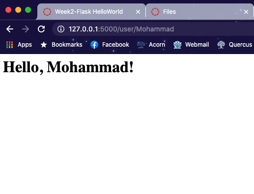

# ECE444-F2020-Lab2

Mohammad Fahad Rahman

This is a clone of https://github.com/miguelgrinberg/flasky

## Activity 1: 

## Activity 2: 

## Activity 3:

Flask context globals is a way for Flask to allow certain objects to be used inside an application as if it were a global variable. There are two types of context:
application context and request context. Flask allows them to be used when an application is active and a request is being handled. Once the request is handled Flask removes them so they are no longer accessible unless saved.